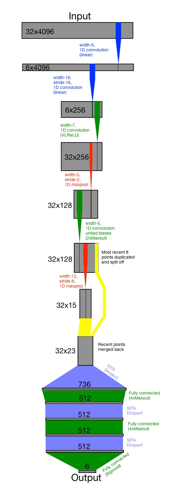

**Name:** Team HEDJ (Tim Hochberg, Elena Cuoco, Esube Bekele, aka Deep, & Jing Fan)

**Location:** Phoenix, AZ; Italy; Nashville, TN

**Email:** tim.hochberg@ieee.org,elena.cuoco@gmail.com, jingfan.kaggle@gmail.com

**Competition:** [Grasp-and-Lift EEG Detection](http://www.kaggle.com/c/grasp-and-lift-eeg-detection)

**Table of Contents**

- [1. Summary](#1-summary)
- [2. Features Selection / Extraction](#2-features-selection--extraction)
- [3. Modeling Techniques and Training](#3-modeling-techniques-and-training)
	- [3.1 Modelling](#31-modelling)
	- [3.2 Training](#32-training)
	- [3.3 Ensembling](#33-ensembling)
- [4. Code Description](#4-code-description)
- [5. Dependencies](#5-dependencies)
- [6. How To Generate the Solution (aka README file)](#6-how-to-generate-the-solution-aka-readme-file)
	- [6.1 Hardware / OS](#61-hardware--os)
	- [6.2 Installing Dependencies](#62-installing-dependencies)
	- [6.3 How to recreate test data.](#63-how-to-recreate-test-data)
	- [6.4 Making predictions on new data](#64-making-predictions-on-new-data)
- [7. Additional Comments and Observations](#7-additional-comments-and-observations)
	- [7.1 EEG features](#71-eeg-features)
	- [7.2 Whitening and LDA classifier](#72-whitening-and-lda-classifier)
	- [7.3  PCA, SVD, ICA](#73--pca-svd-ica)
	- [7.4 Ideas that were tried and abandoned](#74-ideas-that-were-tried-and-abandoned)
- [8. Simple Features and Methods](#8-simple-features-and-methods)
- [9. Figures](#9-figures)
- [10. References](#10-references)

# 1. Summary
This is our 3rd place solution to the [Grasp-and-Lift EEG Detection Competition](http://www.kaggle.com/c/grasp-and-lift-eeg-detection) on [Kaggle](http://www.kaggle.com).

The main aim of the competition was to identify when a hand is grasping, lifting,
and replacing an object using EEG data that was taken from healthy subjects as
they performed these activities. Better understanding the relationship between
EEG signals and hand movements is critical to developing a BCI device that
would give patients with neurological disabilities the ability to move through
the world with greater autonomy.

We would like thank the competition sponsor: [The WAY Consortium (Wearable interfaces for hAnd function recoverY; FP7-ICT-288551)](http://www.wayproject.eu/).

Our primary approach to the [Grasp-and-Lift EEG Detection problem](http://www.kaggle.com/c/grasp-and-lift-eeg-detection) was convolutional neural networks (convnets).

We used very little preprocessing of the data, primarily filtering out the very
low and high frequencies to reduce noise and wander, and relied on the convnet
itself for feature generation and selection. The predictive value of the individual
convnets was quite strong and in the end we simply averaged together the results
of our better performing nets to achieve our final submission.
We used *Nolearn* and the *Lasagne* neural net framework to construct and train our nets.

# 2. Features Selection / Extraction

Essentially all feature extraction was performed automatically by the convnets
themselves during training. On some of the nets we trained, we dropped the first
two channels, because they were noisier than the others. However, this had only
a minor effect on the leaderboard scores. We also varied the start and stop
bands of band pass filter that was applied to the incoming signal. Howevever in
both of these cases, the primary motivation was as much to provide model
diversity as to select features.

# 3. Modeling Techniques and Training

## 3.1 Modelling

Only a single modelling technique was used in the final model: convolutional
neural networks. The *nolearn* front end to the *Lasagne* toolkit was used to
create the neural nets. A variety of nets were developed using a combination of
intuition and trial and error (AKA thinking and tuning). These nets were
evaluated using a combination of local validation and their scores on the public
leaderboard.

A set of variations on the top performing net topologies were created by
varying the types input filtering used as well as by varying the net topology.
Either band-pass or low-pass filtering was used at the input to the net with
various upper and lower (in the case of band-pass filtering) stop frequencies.
The topology of the nets was varied by changing the number of input point, the
sizes of the dense layers as well as the size and number of filters. In addition,
we varied some of the nets by dropping the first two channels of the input data
since they were relatively noisy. These
variations on the top nets were created to increase our model diversity. This
helped our final score when it came time to create an ensemble from the results.

## 3.2 Training

The supplied training data was broken into train and validation sets
using two different methods. In the first method, certain of the
series (typically 3 and 6) were used for validation while the rest were used for
training. In the second method, the last *N* trials of each series were used for
validation while the rest were used for training.  The first method was
used initially, and was used for most of the nets that are submitted, however
when it was finally tried the second method appeared to perform better.

In either case, the time-series data was converted into a set of training
vectors by the simple expedient of taking `sample_size` long windows into the
training data. So, for each time point, the training data consisted of a
`sample_size` long section of training data and the *event* values associated
with the final point of the window. It is important to use the *event* values
for the final point in the series because of the requirement not to use future
data. For time points near the start of the data, this required padding the
supplied data to create a long enough window.

For each "epoch", `train_size` training points were chosen randomly and used to
train a net. The nets in the final ensemble all used binary cross entropy as
their loss function and were trained using Stochastic Gradient Descent (SGD)
updates with Nesterov momentum.

Model Diversity for ensembling:
The nets were trained with a variety of different setups in order to
increase the diversity of the result.

Among the things that made it to the final ensemble were:

- Base nets with various architectures
- Nets trained with different validation serieses.
  For instance, val1 means the network was trained with all other training
  serieses except series 1 and validated with series 1.
- Nets trained with a variety of frequency bands that are known to be useful
  in EEG research. For example, Delta, Theta, Alpha, Beta, and Gamma.
- Nets trained with selected channels.
  Primarily, dropping the first two channels, Fp1 & Fp2 as these are ussually
  contaminated by occular and other sources of noise. When we explored the dataset,
  we actually found out that these two channels were highly contaminated with
  very high aplitude occular artifacts.

## 3.3 Ensembling

The results of the trained nets known or suspected of achieving a score on the
public leaderboard of over 0.963 were combined using a simple weighted average.
Those nets that were known to have very good scores (over
0.97 on the public leaderboard) were weighted 2 while the rest were weighted 1.
Due to a fortuitous mistake, one of the best nets was mistakenly weighted 4
rather than 2 in the final ensemble, which slightly increased our final score.
Although this was a rather naive approach, it still increased our score by
almost a full percentage point; from just over 0.97 for our best single net
to almost 0.98 for the full ensemble.

# 4. Code Description

The primary interface to the code base is contained in *grasp.py* and
*submission.py*. *Grasp* is the module that you'll want to use unless you are
strictly interested in duplicating our leaderboard entry, in which case you'll
be interested in *submission.py*, discussed below in Section 6. The external
interface of *grasp* consists of the following functions:

-  `train_info = train(factory, subject, ...)` -- This method takes a function,
`factory`, that returns a net and trains that net for `subject`. There are a
number of other, optional arguments that can be used to control the details of
the training process and; see the the docstring of `train` for details. This is
not typically called directly, instead `train_all` is called, which in turn
calls `train`. 
-  `train_all_info = train_all(factory, ...)` -- This is the
primary method for training nets. It takes function, `factory`, that returns a
net and uses that to create and train a net for each subject. There are a number
of other, optional arguments that can be used to control the details of the
training process and; see the the docstrings of `train_all` and `train` for
details. 
- `make_submission(train_all_info, path)` -- generates predictions from
`train_all_info` and dump as a csv file to `path` 
- `dump(train_all_info, path)` -- dump the trained model in `train_all_info` to `path`.
- `train_all_info = load(path)` -- load a previously dumped model from `path`.

The location of the train and test files can be set in the file *SETTINGS.json*
by editing the values of *train_dir* and *test_dir*.

The code for instantantiating the neural nets is located in the *nets*
directory. Please examine the code in *net_stf7.py* before examing the other
nets, both since this is both the best performing net and its code has been
cleaned up and fully commented. The nets that made the final ensemble are:

- **net34** --  The earliest net that made our final ensemble. This consists of
a linear stage to reduce the 32 EEG channels down to 4 features. This is
followed by 3 sets of alternating convolutional and maxpooling layers, which is
in turn followed by 2 sets of alternating dense and dropout layers. Except for
the initial, linear stage, this would be fairly typical for an image recognition
net, except for the use of 1D rather than 2D convoltions, except for the rather
drastic maxpooling between the convolutional and dense layers. This 8-wide
maxpooling helps reduce overfitting of the net. The input signal is downsampled
by a factor of 8 before being passed to the net.

- **net_nds4** -- This net has two important changes relative to *net34*. First,
rather than downsampling (NDS is short for No Down Sample), a convolutional
layer with a filter-width of 8 and a stride of 8 is used to reduce the incoming
sample size by a factor of 8. This allows the net to learn a more effective
strategy for downsampling in the form of some sort of weighted average of 8 time
points. Note that in the code this is implemented using a complicated assemblage
of Reshape, DimShuffle and NIN layers for efficieny reasons. The second change
is that, after the convolutional layers, recent time points are duplicated and
passed directly to the dense section of the net, bypassing the drastic
maxpooling. This helps keep overfitting under control, while allowing better
resolution of the location of the onset of an event.

- **net_stf2** -- This net has one important change relative to *net_nds4*, the
replacement of the linear downsample layer with the so called spatio-temporal
filter layer (hence STF). That's a fancy way of saying that we put a linear
convolution on the input of the net that reduces the 32 EEG channels down to
*n_features* channels. Since this is done with a convolutional layer, it allows
the incoming signal to be filtered in both space and time, potentially resulting
in a cleaner input to the net.

- **net_stf3** -- This net is similar to *net_stf2* except that overlapping
maxpooling is used between the convolutional and dense layers.

- **net_stf4** -- This net is similar to *net_stf4* except that N_FEATURES, the
number of channels after the initial reduction, is increased from 4 to 6.

- **net_stf7** -- This net is similar to *net_stf4* except that the initial
reduction in time points is by a factor of 16 rather than a factor of 8 and that
only two convolutional layers are used.

- **net_stf7i** -- Similar to *net_stf7* except that mean pooling is added after
then dense layers.

- **net_stf7m** -- Similar to *net_stf7* except that additional max pooling is
added after then dense layers.

Typical usage of *grasp.py* is as follows:

    import grasp import net_stf7

    # train the net
    train_all_info = grasp.train_all(net_stf7.create_net, max_epochs=50)

    # dump the trained net for later use.
    grasp.dump(train_all_info, "DUMP_FILE_PATH.dump")

    # write out a submission file
    grasp.make_submission(train_all_info, "SUBMISSION_FILE_PATH.csv")

    # if later one wanted to reload and that train_all_info, one could use
    loaded_train_all_info = grasp.load("DUMP_FILE_PATH.dump")

In addition to the files already described there are various support files.
Please see the comments in the code for a description of what each file does.
These support files include:

- *ensemble.py*
- *index_batch_iterator.py*
- *grasp_iterator.py*
- *nnet.py*

# 5. Dependencies

- Python
- Numpy
- Pandas
- Scipy
- Theano
     - A compatible GPU (GTX 980 in our case) and supporting libraries else code will be **very** slow
- Lasagne
- Nolearn

# 6. How To Generate the Solution (aka README file)

## 6.1 Hardware / OS

Here is the hardware configuration of the main box we used for this competition:

### CPU
6 core / 12 virtual with hyperthreding - Intel(R) Xeon(R) CPU E5-2667 0 @ 2.90GHz base clock + turbo+

### GPU
NVIDIA GM204 [GeForce GTX 980]
NVIDIA GM204 [GeForce GTX 980]

### Memory
DDR3 DIMM Mem: 32G  Swap: 225G

### Hard Drive Space
root: / 	100GB
home: /home 1.8TB

### OS
Ubuntu 14.04 LTS

## 6.2 Installing Dependencies

The follwing setup assumes you have Ubuntu 14.04 LTS

Installing python & sklearn:
-   Install build-essential, which is a package in Ubuntu which includes gcc and other build tools

	- `$ sudo apt-get install python-dev`

	- `$ pip install --user -e scikit-learn`

Installing CUDA:
-   Install Cuda 7.0 (preferably 7.5 if you have GTX 980) by downloading the deb/run file from NVIDIA's website.
    Do not install it from the ubuntu ppa repos. The latest version there is always lagging behind.

-   Mostly follow: [The cuda getting started guide](http://docs.nvidia.com/cuda/cuda-getting-started-guide-for-linux/)
	- If for some reason (such as interaction with nouveau driver, etc ...) 
	  the driver doesn't load (which you can check by running `$ cat /proc/driver/nvidia/version`,
      run `$ sudo ldconfig`

-   Run `$ nvidia-smi` to check for proper installation

-   Preferably run `$ cuda-install-samples-6.5.sh ~` and run some of the examples.

Installing Theano:
-   Install Theano dependencies first
    -   numpy
    -   scipy
    -   pip
    -   Just use the following command: `$ suodo apt-get install numpy scipy`
-   `$ git clone git://github.com/Theano/Theano.git`
-   `$ pip install --user -e Theano`
    - This installs Theano from the git repository you just cloned. The `--user` is needed
      if you don't want to install it system wide. You should do this so you don't pollute
      the system wide python packages. Virtualenv is also an option.

-   Follow [The using_gpu tutorial](http://deeplearning.net/software/theano/tutorial/using_gpu.html#using-gpu) to test Theano with the GPU

-   Place the following in ~/.theanorc

        [global]
        device = gpux # where x can be 0,1,2, ... GPU ID you want to make the default
        floatX = float32

Installing Lasagne and Nolearn:
- After making sure that Theano setup works, you can always use the following command to install the latest Theano, Lasagne, & Nolearn packages:

	- `pip install --no-deps git+git://github.com/Theano/Theano`

	- `pip install --no-deps git+git://github.com/benanne/Lasagne`

	- `pip install --no-deps git+git://github.com/dnouri/nolearn`

## 6.3 How to recreate test data.

The file *submission.py* is designed to be used to recreate the ensemble that
was used to generate our third place submission. To generate our result, folow
these four steps:

1. Install all depenencies as descriped below. 

2. Edit SETTINGS.json: 
    - Set `train_dir` and `test_dir` to point to the correct training and
    testing data.

    - Set `dump_dir` and `submission_dir` to point to directories in which to
    write the trained models and the csv files respectively.

    - Optionally set `submission_workers` and `theano_flags`.
    `submission_workers` selects how many worker processes *submission.py*
    should spawn when training. `theano_flags` is a list of flags to pass to the
    theano. The primary use for this is to spread training across multiple GPUs.
    For instance `"theano_flags" : ["device=gpu0", "device=gpu1"] will run half
    the workers on *gpu0* and half on *gpu1*.

3. Run `python submission.py -r run` -- this will run all the models specified in
*final_nets.yml*, write the train models to `dump_dir` and the csv output files
to `submission_dir`. If a dump file with the corresponding name already exists
in *dump_dir*, then the training step will be skipped. If a csv file with the
corresponding name already exists in *submission_dir* then the submission
creation step will also be skipped. If all nets are being rerun from scratch,
this may take several days, depending on your hardware.

4. Run `python submission.py -r ensemble`. This will comput a weighted average of
all of the nets created in step 3 using the weighting scheme we used in our best
submission. The results will be written to `submission_dir` with the name
*ensemble.csv*.

In addition to the above procedure for generating *ensemble.csv*,
*submission.py* has a few other potentially useful commands.

- `python submission.py -r dry` -- performs a dry run; instantiating all nets but
not training

- `python submission.py -h` -- show a numbered list of the nets in
*final_nets.yml*

- `python submission.py -r run -n <N>` -- train and dump only net
number N, where N is the number given py the previous command.

Note that `python submission.py -r run` **will not** overwrite already existing
files, so if you wish to replace files you will have to remove them manually
before starting the run.

### Differences from our third place score

We could not completely recreate all of the training parameters used in a few of the
earlier nets and as a result the score produced by submission.py
doesn't exactly reproduce our third place score. Instead, it results in a
slightly higher score of 0.98001. In addition, despite setting the random seed,
we have observed some differences between different machines, perhaps due to the
underlying hardware. As a result, rerunning this code may result in slightly
different scores, although they should be quite close.

## 6.4 Making predictions on new data

To make a prediction on a new test set, one would simply make a new test
directory containing the new data and point SETTINGS.json to that directory.

# 7. Additional Comments and Observations

## 7.1 EEG features

We attempted to extract features from the raw data and then train linear
classification models using the extracted features and the predictions from
convolutional neural networks. Features were extracted for each sample from a
epoch that contains 512 samples. The extracted features represented only the
last sample in the epoch to avoid predicting using data from the future. For the
first 512 samples in a series, their features were the same. We then shifted the
epoch window by one sample at a time to calculate features for the rest of the
samples.

Before chopping a series of EEG data into epochs, we performed basic
preprocessing including smoothing and filtering. We smoothed the raw signals
using a Savitzky-Golay filter to remove large spikes we noticed in the signals.
And 4th order butterworth filters were used to low pass signals at 50Hz and high
pass signals at 0.2Hz. Four types of features were extracted from each epoch:
(a) Individual spectral power from 32 electrodes. We computed the power spectral
density variables for ten frequency bands, including deta (1-4Hz), theta
(4-8Hz), alpha1 (8-10Hz), alpha2 (10-12Hz), alpha (8-13Hz), central beta
(14-18Hz), beta2 (18-26Hz), beta (13-30Hz), partial gamma (36-40Hz), and gamma
(30-45Hz). (b) Spectral power of the hemispheric asymmetry index for 14
electrode pairs. Hemispheric asymmetry index (logR-logL) was calculated for each
frequency band from pairs of left and right electrodes. (c) The mean and
standard deviation of the time series from 32 electrodes. (4) The autoregressive
parameters of the time series from 32 electrodes. The autoregressive parameters
were estimated using adaptive autoregressive algorithm with model order equals
to 10 and recursive least squares approach. The total number of features were
844.

In the end, we didn't extract features for all the series and abandoned this
appoach due to the time costs to extract features. Welch's power spectral
density estimate and adaptive autoregressive algorithm contributed the most to
the computation time.

## 7.2 Whitening and LDA classifier

We also tried to preprocess the data with a whitening filter, based on
Autoregressive modeling and Linear Predictor Filter. For each channel and for
each subject, the 1st series was used to estimate the AR parameters with an AR
order of 512 and the reflection coefficients in order to implement the whitening
filter on the following data, which will feed the LDA classifier. The whitening
procedure will reduce the artifact and enhance the transient signals. The
results with LDA were not good as expected. For lack of time, no trial were done
with the Neural Network on whitened data, so at the moment we don't know if this
preprocessing technique could give better results.

## 7.3  PCA, SVD, ICA

Other preprocessing steps were tried with linear classifiers. We tried most of
the routines in scikit-learn library for the principal components decomposition
to reduce the number of features. This procedure can work were well with linear
data, since they rely on diagonalization of covariance matrix. With this data
the results were worse than considering all the channels. Considering how the
neural net worked well on these data, we have to suspect the presence of high
non linear noise or non linear coupling among the channels, which  Neural Nets
were able to disentangle and manage.

## 7.4 Ideas that were tried and abandoned

We have tried some ideas and due to shortage of time and/or ineffectiveness of
the methods we abandoned several ideas including, but not limitted to:

- Using the [AdaDelta](http://arxiv.org/pdf/1212.5701.pdf)  optimization in addition to Stochastic Gradient Decent (SGD).
- Transform the original EEG channels using CSP. This one was a bit difficult
  as some of the events were overlapped. But, we were hopping to at least use
  event 1, events 2,3,4 and event 5,6 as these groups were distinct non-overlapping
  and add the transformed channels to the original EEG.
- Probability calibration to make the start of the events prediction a bit sharper.
- L2 regularization.
- Per subject and per event model training.
- Last but not least, training 2D conv nets by first transforming the data into 2D
  short time spectrogram images.
- Denoising using wavlet denoising or xDawn.

# 8. Simple Features and Methods

The nets were relatively strong predictors, with the best scoring roughly 0.97
on the private leaderboard. This is as compared to our final score of 0.97996
and the first place score of 0.98109. So the individual nets, without ensembling
got us most of the way to our final solution.

# 9. Figures

- **Structure of our most succesful net (net_stf7)**

# 10. References
- [Convolutional Neural Networks Tutorial](http://deeplearning.net/tutorial/lenet.html)

- [Nolearn Github repository](https://github.com/dnouri/nolearn)

- [Lasagne Documentation](http://lasagne.readthedocs.org/en/latest/)

- [Theano Homepage](http://deeplearning.net/software/theano/)

- [Python Homepage](https://www.python.org)

- [GPU Setup for Theano](http://deeplearning.net/software/theano/tutorial/using_gpu.html)

- [Scikit Learn](http://scikit-learn.org/)